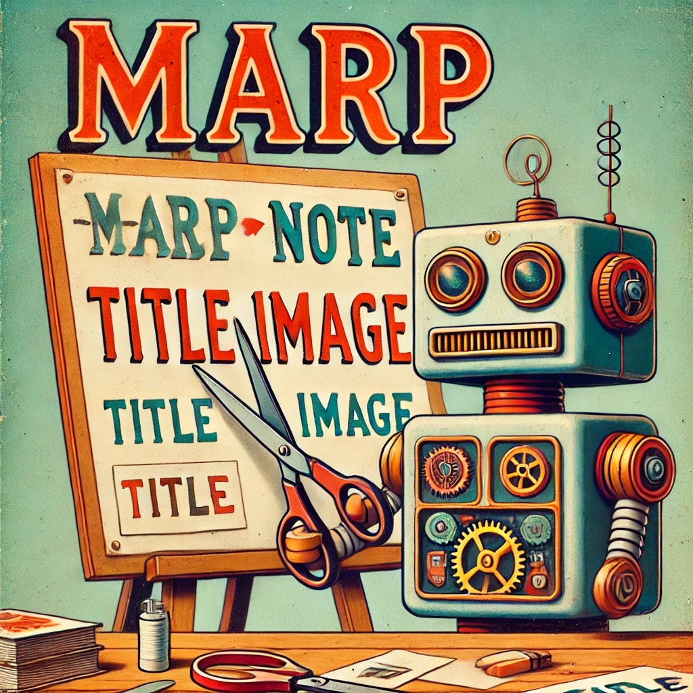

<!--
headingDivider: 1
-->

<!-- class - white / black / kintone / normal  -->

# <!-- class: normal -->
※AI画像にMarpでテロップを追加

# <!-- class: white -->
※AI画像にMarpでテロップを追加

# <!-- class: black -->
※AI画像にMarpでテロップを追加

# <!-- class: kintone -->
※AI画像にMarpでテロップを追加

